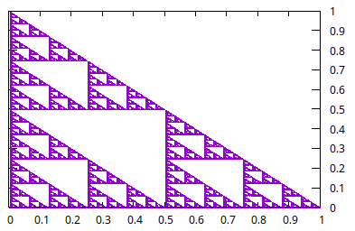

# IFS on C plotted on gnuplot (WPI)

Uses an Iterated Function System to plot different fractal structures. Modify transformations.c to alter the resulting image.

### requirement:
-gnuplot

### Usage:

make plot iter=<n_of_iterations>

Example plot with
10000 iterations

References:
https://flam3.com/flame_draves.pdf